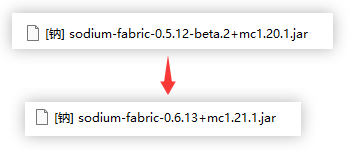
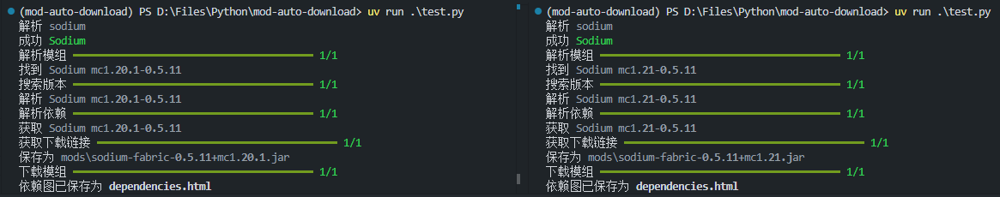
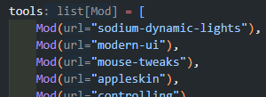
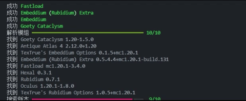
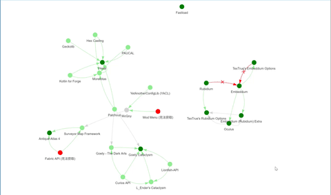

# Mod Auto Download

一个跨版本 Minecraft 模组下载器


## 简介

你有没有遇到过，每次更新游戏版本时，都要重新下载同一批模组的情况？

<figure>
  
  <figcaption style="color:lightgrey">版本更新后，手动下载新版本的钠模组。天哪！</figcaption>
</figure>

如果你遇到过此类情况，本脚本便是其中一种解决方案

```python
get_mod(
    [Mod("sodium")],
    "1.20.1",  # "1.21.1"
    "fabric",
    "mods",
)
```

<figure>
  
  <figcaption style="color:lightgrey">只需要更改版本参数，就可以自动下载不同版本的同一个模组！</figcaption>
</figure>

你也可以使用自己的模组列表，别的版本或者模组加载器

且会自动解析模组依赖!

<figure>
  
  <figcaption style="color:lightgrey">带上所有你喜欢的模组！</figcaption>
</figure>

如果解析出现了问题，日志会告诉你发生了什么，对于依赖还会生成一个可视化网页提供排查！

<div style="display:flex; justify-content:space-between; align-items:flex-start; gap:10px;">
  <figure style="flex:1; margin:0; text-align:center;">
    
    <figcaption style="color:lightgrey">输出简单的提示信息</figcaption>
  </figure>
  <figure style="flex:1; margin:0; text-align:center;">
    
    <figcaption style="color:lightgrey">或者打开生成的网页 (dependencies.html) ……</figcaption>
  </figure>
</div>

## 快速开始

克隆项目

```shell
git clone https://github.com/peter2500zz/mod-auto-download
cd mod-auto-download
```

使用 uv (推荐)

```shell
uv sync

uv run example.py
```

使用 pip

```shell
python -m venv .venv
# Windows
.venv\Scripts\activate
# macOS / Linux
source .venv/bin/activate

pip install -r requirements.txt

python example.py
```

`example.py` 中已经写好了一个使用示例，你随时可以进行扩展和修改

---

欢迎 issue 和 pr！
